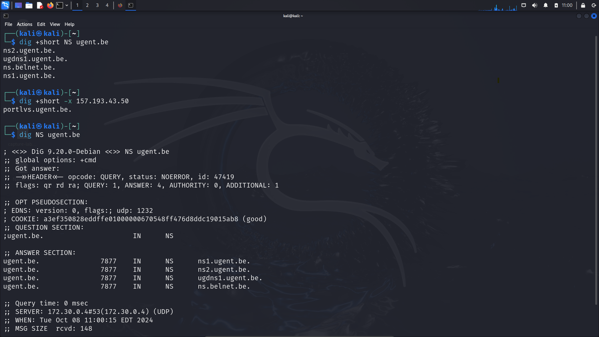
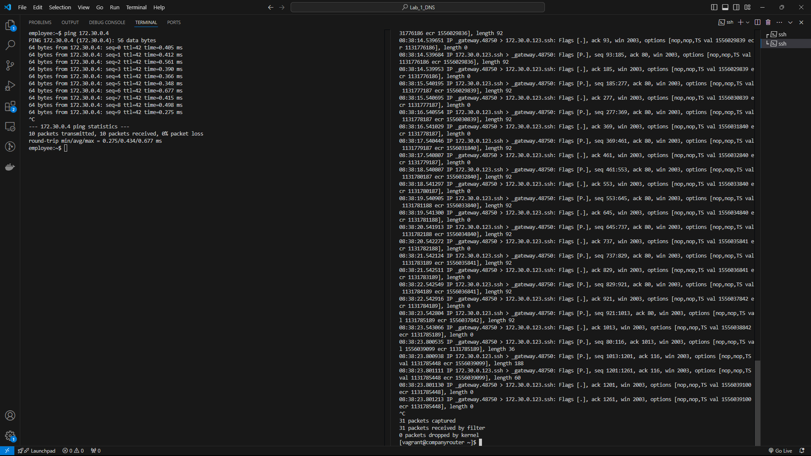
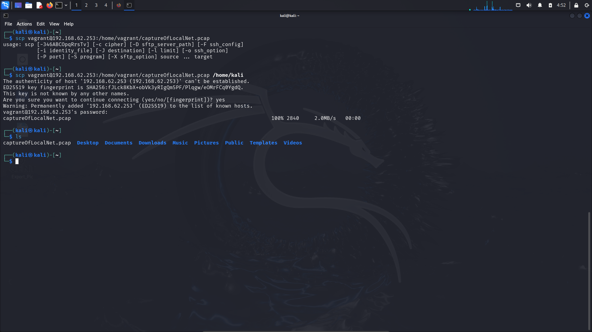

# List with possible theoretical questions 

## Chapter 1: DNS ([Lab 1](Notes-Lab01.ipynb))

1. What is the swiss cheese model and how can it be applied to cybersecurity?

   The swiss cheese model portraits the numerous independent layers that overlap to eliminate  risk. It has a multilayer approach, this means in case of failure at one layer, the other layers will withstand potential breaches.

   The Swiss Cheese Model is a framework that illustrates how multiple leayers of security  work together to create an impenetrable defense system. Each layer with its own strenghts and weaknesses.

   The essence of the swiss cheese model is to keep in mind that a singular security measure is never foolproof when alone. It represents a system where each layer's weakness is covered by another layer's strenght.

   Slices / Layers:
      1) Web Filtering - Host-based Protection
      2) Brower Extension - URL-based Security
      3) Signature-based Scanning
      4) AMSI Scans and Windows Integration
      5) Reputation Lookups (Cloud)
      6) Behavior Blocking and System Monitoring
      7) Windows RDP Attack Detection
      8) Exploit Protection
      9) Comprehensive Ransomware Defence
      10) Endpoint Detection and Response (EDR)
      11) Emergency Network Lockdown - Device Isolation
      12) Shutdown & Uninstall Prevention
      13) Windows Firewall Monitoring & Hardening
2. What different type of network attacks exist?
   1. What is a (D)DoS attack?
      - Distributed Denail of Service Attack
      - It is an attack that aims to bring down a server/ service with a coordinate request that consists of al large grouping of request.
      - Example: [DDOS attack mitigation Cloudflare](https://blog.cloudflare.com/how-cloudflare-auto-mitigated-world-record-3-8-tbps-ddos-attack/)
      - ELI5
        - Distributed Denial Of Service. 
        - Meaning there's multiple people/computers involved. So rather than one attacker, you've got a mob. Sometimes the mob cooperates willingly (eg, all participants agree they hate this particular business). Sometimes the mob is tricked into it (somebody spreads a rumor that a pizzeria is giving out free pizza, and the store floods with people expecting free stuff).
   2. How can DNS be considered an attack vector as well?
      - Firstly what is an attack vector
        - An attack vector is a specific path or method used to gain unauthorized access to a system, network or application
        - Examples of attack vectors
          - Social Engineering
          - Malware
          - Web-based
          - Network-based
          - Physical attacks
          - Password attacks
      - Now How is DNS an attack vector aswell
        - First of all the DNS protocol is essential to every internet-based service.
        - DNS is an inherently insecure protocol and a fundamental piece of operations of the internet and applications
        - Many DDOS attacks rely on ways to abuse DNS
          - DNS Spoofing
          - DNS Hijacking
          - DNS Tunneling
          - Cache Poisoning
          - (Distributed) Denial of Service
          - Ampification Attacks
3. DNS
   1. What information can be enumerated from a DNS server
      - DNS Records:
         - A-records = domain linked to ipv4
         - AAAA-records = domain linked to ipv6
         - MX-records = ip and location of mail server on network
         - NS-records = ip and location of name server on network
         - CNAME-record = links several domains together
         - TXT-record = various text info
         - SOA-record = info about admin
         - Subdomain Enumeration
         - Reverse DNS Lookups
         - Zone Transfer
         - Service Record
         - TTL
         - Info about version
   2. When is it intended? What is considered a "normal" DNS resolve and how can you perform it using a CLI tool?
      - It is intended on when the local dns cache doesn't know the IP address to the corresponding Domain. You can do this manually by using the command `nslookup` or `dig`
   3. What is, and how can you perform a reverse lookup?
      - The reverse lookup is a DNS query. It will look for the domain name corresponding with an IP address.
        - This is basicly the reverse of a normal dns lookup where you use the domain name to get the corresponding IP address
      - `nslookup` can preform the reverse lookup
   4.  What is meant by authoritative nameservers?
      - This type of DNS Server contains information specific to the domain name it serves.
      -  Aswell as provide a recursive resolver with the IP address of that server found in the DNS A record, or if the domain has a CNAME record
      -  It will provide the recursive resolver with an alias domain, at which point the recursive resolver will have to perform a whole new DNS lookup to procure a record from an authoritative nameserver.
   5. What is a zone transfer attack and why is it called an attack? Is a zone transfer always harmful?
      - A zone transfer attack is a type of security vulnerability that exploits the DNS (Domain Name System) mechanism used to replicate DNS databases (zone files) between primary and secondary authoritative nameservers. In a zone transfer, a secondary nameserver requests a copy of the zone file from the primary nameserver to ensure it has up-to-date DNS records.
      - A zone transfer is considered an attack when it is conducted without proper authorization. If a DNS server is misconfigured to allow zone transfers to any querying host, an attacker can exploit this vulnerability to obtain sensitive information about the domain's DNS records.
      - Not Always Harmful: A zone transfer in itself is not harmful; it is a legitimate mechanism for DNS management and redundancy. However, when allowed without restrictions, it can lead to security issues. If an attacker gains access to sensitive DNS information, they may use it to launch further attacks.
4. tcpdump (or alternatives)
   1. How can you create a network dump, only using the CLI, on a machine without a GUI?
      - Using tcpdump:
         - ```shell
            sudo apt-get install tcpdump
            tcpdump -D
            sudo tcpdump -i <interface> -w <filename).pcap
            sudo tcpdump -i <interface) port not 22 -w <output_file).pcap -> to skip ssh
            sudo tcpdump -i <interface> port 80 -w <output_file>.pcap -> only http
            ```
      - Using tshark:
         - ```shell
            sudo apt-get install tshark
            tshark -D
            sudo tshark -i <interface> -w <filename>.pcap
            sudo tshark -i <interface> port not 22 -w <output_file>.pcap -> to skip ssh
            sudo tshark -i <interface> port 80 -w <output_file>.pcap -> only http
            ```
## Lab Notes

### Preparation

Full setup is done, proof:


### Recap DNS: basic DNS queries

1. `nslookup`
   - 
2. `dig`
   - 
3. Extra info
   - When a DNS server is redundant (master/slave), the entire zone can be transferred from the primary server to the secondary server. Nothing wrong there: it is a feature of DNS. However, when badly configured, the content of the entire zone might be accessible to everybody on the Internet.

### Recap Wireshark

1. What layers of the OSI model are captured in this capturefile?

   - Data Link Layer (Layer 2)
     - MAC addresses.
     - Frame control fields.
     - VLAN tags (if present).
   - Network Layer (Layer 3)
     - IP packets (IPv4 or IPv6), including headers (source and destination IP, TTL, etc.).
     - Other Layer 3 protocols (e.g., ICMP, ARP, or RARP).
   - Transport Layer (Layer 4)
     - TCP segments (including sequence numbers, flags, ports, etc.).
     - UDP datagrams.
     - Other transport layer protocols (e.g., SCTP, DCCP).
   - Session Layer (Layer 5)
     - Protocols like SMB or PPTP
   - Presentation Layer (Layer 6)
     - SSL/TLS, encoding scheme
   - Application Layer (Layer 7)
     - HTTP, DNS, FTP, SMTP, etc.
     - Decoded data for readable analysis (e.g., HTTP headers and body).

2. Take a look at the conversations. What do you notice?

   - There is a lot of TCP-traffic going over port 9999, which is not a standard port.
   - 

3. Take a look at the protocol hierarchy. What are the most "interesting" protocols listed here?

   - Most notable are SSH, LDAP and HTTP.
   - LDAP is potentially the most interesting since this one is used for AD.
   - 

4. Can you spot an SSH session that got established between 2 machines? List the 2 machines. Who was the SSH server and who was the client? What ports were used? Are these ports TCP or UDP?

   - SSH is visible with use of filter -> 172.30.128.10 and 172.30.42.2
   - Client is .128.10, Server is .42.2
   - Used port for SSH is :22
   - SSH uses TCP.
   - 

5. Some cleartext data was transferred between two machines. Can you spot the data? Can you deduce what happened here?

   - Data is sent via port 9999, propably a type of reverse-shell.
   - The commands found indicate someone tried to access the passwords of a user.
   - 

6. Someone used a specific way to transfer a png on the wire. Is it possible to export this png easily? Is it possible to export other HTTP related stuff?

   - PNG's sent via normal means can be easily exported, hidden png however need more searching work.
   - 
   - 

### Capture traffic using the CLI

Full setup is done, proof:


Overview IP addresses


1. Which interface on the companyrouter will you use to capture traffic from the dns to the internet?

   - 172.30.255.254 = Interface eth2 (visible with `ip a`)

2. How do you test the setup?

   - `sudo tcpdump -i eth2 tcp`
     - option `tcp` to limit the amount captured
     - `-i` to specify the specific interface, here `eth2`
   - 

3. Write to a file to use in Wireshark?

   - `sudo tcpdump -i eth2 -w captureOfLocalNet.pcap`

4. Transfer capture to host/kali machine?

   - `scp vagrant@192.168.62.253:/home/vagrant/captureOfLocalNet.pcap /home/kali`
   - 

5. Capture without SSH packets?

   - `sudo tcpdump -i eth2 tcp and not port 22`
     - option `and not port 22` specifies to skip all packets over port 22(SSH)

6. Capture HTTP traffic from ISP and router?

   - `sudo tcpdump -i any tcp port 80 -w captureDNSRequest.pcap`
   - `sudo echo nameserver 172.30.0.4 >> /etc/resolv.conf`
     - used to troubleshoot isprouter, since without this line host can't be resolved
   - `curl http://www.cybersec.internal` used in isprouter
   - 
   - For the Employee no traffic is visible, since he does not need to go outside the network and thus is not seen by companyrouter.

### Understanding the network

Full setup is done, proof:

this is the same picture as the first one, this kali is connected on the 'fake internet'

1. What did you have to configure on your red machine to have internet and to properly ping web?

   - Give the kali an IP within range(`192.168.62.69`) of the 'fake internet', set the dns to `172.30.0.4`

2. What is the default gateway of each machine?

   - [172.30.0.4; 172.30.0.10; 172.30.0.15; 172.30.0.123] = Internal -> 172.30.255.254
   - [172.10.10.123] = Remote -> 172.10.10.254
   - [192.168.62.42; 192.168.62.69] = Fake Internet -> 192.168.62.254
   - [10.0.2.3] = Virtualbox -> 10.0.2.2
   - [192.168.62.254] = ISP Router -> 10.0.2.15
   - [172.30.255.254] = Company Router -> 192.168.62.254
   - 

3. What is the DNS server of each machine?

   - 

4. Which machines have a static IP and which use DHCP?

   - In current setup: all machines are static
   - Ideally: employees (remote and on-prem) and own laptop

5. What (static) routes should be configured and where, how do you make it persistent?

   - 

6. What is the purpose (which processes or packages for example are essential) of each machine?

   - DNS
     - Redirecting request to the network towards the webserver.
     - Uses BIND package
   - Web
     - Hosts the website and communicates with the database.
     - Uses APACHE package
   - Database
     - Contains all relevant data used on the webpage.
     - Uses MARIADB package


### Zone transfer attack

1. Testing with `dig axfr @172.30.0.4 cybersec.internal`

   - 

2. Solving the zone transfer weakness

   - 
   - After this: `sudo service named restart`

3. Test if site is still accesible but zonetrasfer isn't

   - 

4. To test if zone transfer is possible via windows

   - 
## Chapter 2: Firewall ([Lab 2](Notes-Lab02.ipynb))
1. In terms of the OSI model, what does a firewall do?
   - A firewall operates mainly at the Network (Layer 3) and Transport (Layer 4) layers of the OSI model, filtering traffic based on IP addresses, ports, and protocols. Modern firewalls can also work at the Application layer (Layer 7), inspecting and controlling data based on specific applications or content.

2. Review the advantages and disadvantages of a host-based firewall vs a network-based firewall.
   - Host-Based Firewall:
     - Advantages: Granular control, protects remote devices, application-specific filtering.
     - Disadvantages: Resource-intensive, hard to manage across multiple devices, vulnerable if the host is compromised
   - Network-Based Firewall:
     - Advantages: Centralized control, network-wide protection, scalable, offloads processing.
     - Disadvantages: Less host-specific control, internal threats may bypass it, can be a single point of failure.

3. What is meant by network segmentation and what are network/firewall zones?
   - Network segmentation is the practice of dividing a network into smaller, isolated sections (segments) to improve security and performance. Each segment can enforce specific security rules, limiting the spread of threats and controlling access between different parts of the network.
   - Network/firewall zones are logical groupings of network segments with similar security requirements. Firewalls control traffic between these zones by applying security policies. Common zones include:
     - Trusted zone: Internal network (e.g., corporate LAN).
     - Untrusted zone: External networks (e.g., the internet).
     - DMZ (Demilitarized Zone): A buffer zone for public-facing services like web servers.
   - Zones enhance security by controlling traffic flow between different areas of a network.

4. What is a DMZ? How can you build this with 1 firewall vs 2 firewalls? Are there advantages?
   - A DMZ (Demilitarized Zone) is a network segment between an internal network and an external network (like the internet). It hosts public-facing services (e.g., web servers) while isolating them from the internal network to enhance security.
   - 1 Firewall Setup:
     - Configuration: One firewall with three interfaces (internal, DMZ, external).
     - Advantages: Cost-effective and simpler to manage.
     - Disadvantages: Single point of failure; if compromised, both the DMZ and internal network are at risk.
   - 2 Firewalls Setup:
     - Configuration: Two firewalls (one between the internet and DMZ, the other between DMZ and internal network).
     - Advantages: Enhanced security (defense in depth) and better isolation.
     - Disadvantages: Higher costs and increased complexity in management.

5. Nmap:
   1. When scanning a TCP or UDP port with nmap, what is the difference between open, filtered and closed? How is nmap able to make this conclusion?
      - Open:
        - Definition: The port is actively accepting connections.
        - Nmap Conclusion: Nmap receives a response (like a SYN-ACK for TCP) indicating the port is open.
      - Closed:
        - Definition: The port is accessible but not accepting connections.
        - Nmap Conclusion: Nmap receives a response (like a RST packet for TCP) indicating the port is closed.
      - Filtered:
        - Definition: The port is being filtered by a firewall or other security device, preventing Nmap from determining its status.
        - Nmap Conclusion: Nmap does not receive any response or receives an ICMP unreachable message, indicating that the port's status cannot be determined.

   2. Review cybersecurity and virtualisation: what is a banner grab and how do you do this using nmap?
      - Banner grabbing is a technique used to collect information about services running on a server by sending a request to a specific port and reading the response. This information often includes details about the service name, version, and sometimes the operating system. Banner grabbing is commonly used in security assessments and reconnaissance to identify potential vulnerabilities in software.
   - `nmap -sV 172.30.0.10`

6. Systemd
   1. Where can you find the existing systemd configuration files on a Linux system with systemd?
      - `/etc/systemd/`

   2. Review the following systemctl subcommands: `systemctl cat ...`, `systemctl show ...`, `systemctl edit ...`, `systemctl list-units`, `systemctl list-unit-files` and `systemctl daemon-reload`.
   - systemctl cat ...
     - This command is useful for viewing the full configuration of a unit, including the main unit file and any additional configurations that override settings.
   - systemctl show ...
     - This command provides a comprehensive list of all the properties associated with the unit, such as its state, dependencies, and resource limits. It’s useful for debugging and understanding the unit's configuration.
   - systemctl edit ...
     - This command allows you to customize or override the configuration of a unit without modifying the original unit file. The changes are saved in a drop-in directory specific to the unit.
   - systemctl list-units
     - This command is useful for quickly checking which units are currently active, along with their status (running, failed, etc.).
   - systemctl list-unit-files
     - This command provides an overview of all unit files, regardless of their current state, allowing you to see what is available and how they are configured to start.
   - systemctl deamon-reload
     - This command is necessary after making changes to unit files or creating new unit files. It instructs systemd to re-scan its configuration and apply any changes without restarting the system.


   3. How can you create your own systemd service? Note: you don't need to learn this out of the top of your head, but you should be able to interpret a given systemd unit file.
      - Creating a custom systemd service involves:

        - Writing a script or binary to run as a service.
        - Creating a unit file in /etc/systemd/system/.

          - ```bash
            [Unit]
            Description=test

            [Service]
            ExecStart=/path/to/your/script.sh
            Restart=always

            [Install]
            WantedBy=multi-user.target
            ```

        - Reloading systemd, enabling, and starting the service.
        - Checking its status and logs for debugging.

   4. What are systemd-timers?
      - Systemd timers provide a flexible, integrated way to schedule tasks in systemd environments, allowing for better management and logging of scheduled jobs.

7. Proxy:
   1. What is a (forward) proxy?
      - A forward proxy is an intermediary server that sits between a client (like a user's computer) and the internet. It acts as a gateway for client requests to external servers, facilitating the communication and often providing additional features such as anonymity, security, and content filtering.

   2. What is a reverse proxy?
      - A reverse proxy is a server that sits between client devices and a backend server, intercepting requests from clients and forwarding them to the appropriate backend server. Unlike a forward proxy, which acts on behalf of the client, a reverse proxy acts on behalf of the server.

   3. How are (reverse) proxies related to load balancers? Do you know software that can do both?
      - Relationship:
         - Reverse Proxy: Acts as an intermediary between clients and backend servers, forwarding requests and providing features like SSL termination, caching, and security.
         - Load Balancer: Specifically distributes incoming traffic across multiple backend servers to ensure no single server is overwhelmed, enhancing availability and reliability.
         - Many reverse proxies include load balancing functionality, making them essential for high-availability and scalable web applications.
        - Software:
         - Nginx: High-performance web server that acts as both a reverse proxy and load balancer.
         - HAProxy: Widely used for load balancing and reverse proxying TCP and HTTP applications.
         - Apache HTTP Server: Can be configured with mod_proxy for reverse proxy and load balancing.
         - Traefik: Modern reverse proxy and load balancer designed for microservices with dynamic routing.
         - Caddy: Easy-to-use web server with automatic HTTPS and reverse proxy capabilities.

## Lab Notes

### Attacker virtual machine red

1. What routes do you need to add?

   - TODO

2. What is the default gateway?

   - TODO

3. Does your red have internet? If not, is it possible? Why not OR how?

   - TODO

### The insecure "fake internet" host only network

1. What insecure practices can be found?

   - Use of http
     - Network traffic is not encrypted and thus can be seen in plaintext.
   - Ability to execute scripts on the site http://www.cybersec.internal/cmd
     - Command injection possibel here.
   - Nmap finds open ports on several servers.
     - Should be blocked by a firewall.

2. What does the -sC option do in Nmap?

   - Default Scripts: These scripts are designed to provide helpful information during a scan without being overly intrusive. They include scripts for service detection, versioning, and enumeration, such as checking for:
     - Common vulnerabilities.
     - Misconfigurations.
     - Service banners.
     - Open ports and services.
     - Equivalent to: `--script=default`

3. Is SSH possible to another machine?

   - TODO

### Network Segmentation

1. What is meant with the term "attack vector"?

   - An attack vector refers to the specific method or pathway that an attacker uses to gain unauthorized access to a system, network, or application to deliver malicious activities such as stealing data, disrupting operations, or installing malware. It represents the "entry point" and severety of possibility for an attack.

2. Is there already network segmentation done on the company network?

   - TODO

3. Remember what a DMZ is? What machines would be in the DMZ in this environment?

   - Web Server:
     - If your web server hosts public-facing websites or services, it should be in the DMZ. This ensures that any compromise of the web server does not directly impact the internal network.
   - DNS Server (Public-Facing):
     - If your DNS server handles requests from the internet (e.g., resolving domain names to IP addresses for external users), it should also be in the DMZ to protect internal systems in case of DNS vulnerabilities or attacks.

4. What could be a disadvantage of using network segmentation in this case? Tip: client <-> server interaction.

   - A potential disadvantage of using network segmentation in this environment, particularly in the context of client-to-server interactions, is the added complexity and potential latency or communication overhead between the client computers and the servers (e.g., web server or database server).

5. List out and create an overview of the advantages and disadvantages.

   - Advantages:
     - Improved Security:
       - Containment of Breaches: If an attacker compromises a system in the DMZ (e.g., a web server), segmentation prevents lateral movement to the internal network or other sensitive systems like the database server.
       - Reduced Attack Surface: Limits exposure of sensitive resources (e.g., database servers) to external threats by isolating them from public-facing systems.
     - Access Control:
       - Granular Policies: Segmentation allows specific rules for traffic between segments, ensuring that only authorized systems and protocols are allowed.
       - Least Privilege: Clients and servers interact only on a need-to-know basis, reducing potential misuse or unauthorized access.
     - Improved Performance:
       - Traffic Isolation: Segmentation reduces congestion by isolating traffic flows, such as keeping internal client-to-database traffic separate from internet-facing web server traffic.
     - Easier Monitoring and Management:
       - Segmentation can improve visibility and control over traffic, allowing for faster detection of anomalies or breaches.
   - Disadvantages:
     - Loss of Functionality:
       - Restricted Client-Server Interaction: Strict firewall rules or routing between segments might block legitimate communications between clients and servers if not properly configured.
       - Dynamic Ports and Complex Apps: Applications requiring dynamic ports or complex interactions (e.g., VoIP, FTP, or cloud services) may face connectivity issues.
     - Increased Latency and Overhead:
       - Firewalls, routers, or other inspection points between segments introduce processing delays and can reduce network performance, especially in high-traffic scenarios.
     - Operational Complexity:
       - Configuration Challenges: Designing and maintaining segmentation rules can be time-consuming and prone to human error.
       - Troubleshooting: Diagnosing issues becomes more challenging as multiple segments, rules, and devices must be analyzed to locate and resolve problems.
     - Scalability Limitations:
       - As the network grows, segmentation policies can become harder to manage, requiring more resources and tools for efficient administration.
## Chapter 3: SSH ([Lab 3](Notes-Lab03.ipynb))
1. What are the essential elements to configure SSH properly:
   1. Logging in remotely using keys instead of user/password
      - To disable the ability to login via username and password: `PasswordAuthentication no`
        - make sure your pubic key is placed in authorized_keys beforehand!
      - authorized_keys is a place where public keys of allowed people are stored.
      - known-hosts is a place where previously connected (to) public keys of servers are located, this to prevent MITM.

   2. `authorized_keys` file
   3. `known-hosts` file
   4. SSH config for client and server
      1. `ssh web` for example should automatically login to the webserver. This is perfectly possible from your host system!
   5. The difference between a passphrase on a key vs user/password

   - The main diofference lies in where the password is used. with user/password the password is needed at client and server and can be intercepted. While the passfrace is only used to descipher the private key to see if it matches with the public key stored in the server. Even when the server is compromised the key is safe.

2. How do you configure aliases for connecting to predetermined servers?

   - Generate ssh keypair `ssh-keygen -t rsa -b 4096 -C "CompanyRouter-Webserver"`.
     - -t = type of encrytpion
     - -b = amount of bits in key
     - -C = provide a comment
   - Copy public key to webserver `ssh-copy-id vagrant@172.30.0.10`.
   - For LINUX: configure SSH alias by adding this to ~/.ssh/config:
     - ```code
       Host web
           HostName 172.30.0.10
           User vagrant
           Port 22
           IdentityFile ~/.ssh/id_rsa
       ```
   - For WINDOWS: configure SSH alias by adding this to C:/users/woutd/.ssh/config:
     - ```code
       Host web
           HostName 172.30.0.10
           User vagrant
           IdentityFile C:\Users\woutd\.ssh\id_rsa
       ```
3. What is meant by a Jump/Bastion host and why would a company use this?
   - It provides a single point of access to the outside world which makes it easier to monitor what connections are made and what they are doing. Thanks to this implmentation the underlying network can be made with less restrictions.

4. What is the difference between local and remote port forwarding using SSH? You should be able to explain the difference using a proper use case.

   - Local port forwarding is used when you want to access a remote service from your local machine, and it forwards traffic from local to remote.
     - Use-case: If you want to access a database or webpage behind a firewall that blocks specifick ports on a remote network.
   - Remote port forwarding is used when you want to allow users on a remote server to access a local service, and it forwards traffic from remote to local.
     - Use-case: Allowing a remote server to access a service you are running on your local machine
   - Works somewhat like a static route for services on specific ports.


5. What is the SOCKS protocol conceptually and give an example where or when this might be interesting.

   - The SOCKS protocol is a versatile proxy protocol used to route any kind of network traffic between a client and a server through a proxy. It can handle both TCP and UDP traffic and is application-agnostic, making it useful for many purposes like bypassing firewalls, anonymizing traffic, or securing connections when used with SSH or other encryption tools. SOCKS5 is the most advanced version, supporting authentication and domain name resolution.
     - Usage : accessing pages blocked by a firewall or by a country
     - command: ssh -D 8080 vagrant@172.30.255.254 => sets up a SOCKS proxy at port 8080 on machine 172.30.255.254
       - -D 8080 sets up a local SOCKS proxy that listens on the specified port (8080 in this case).
       - Any traffic sent to this local proxy port is securely forwarded to the remote server (172.30.255.254) and then out to its destination.

6. Difference between SOCKS and HTTP proxy:

| **Feature**           | **SOCKS Proxy**                                                                    | **HTTP Proxy**                                                               |
| --------------------- | ---------------------------------------------------------------------------------- | ---------------------------------------------------------------------------- |
| **Protocol Type**     | Operates at the transport layer (TCP/UDP).                                         | Operates at the application layer (HTTP).                                    |
| **Supported Traffic** | Handles any type of traffic (e.g., HTTP, FTP, SMTP, etc.).                         | Only handles HTTP/HTTPS traffic.                                             |
| **Versatility**       | More versatile, supports various protocols.                                        | Limited to web traffic (HTTP and HTTPS).                                     |
| **Traffic Handling**  | Works at a lower level, forwards raw packets.                                      | Interprets and modifies HTTP requests/responses.                             |
| **Authentication**    | Supports username/password authentication (optional).                              | Typically supports basic and NTLM authentication.                            |
| **Configuration**     | Applications must explicitly support SOCKS or use additional tools like tun2socks. | Easier to configure in web browsers and tools.                               |
| **Performance**       | Generally faster due to minimal overhead.                                          | Can be slower due to traffic inspection and modification.                    |
| **Use Case Examples** | Torrenting, gaming, and handling non-HTTP traffic.                                 | Web browsing and content filtering.                                          |
| **Anonymity**         | Better anonymity; doesn't expose application details.                              | Limited anonymity; forwards HTTP headers that may reveal client information. |
| **Encryption**        | Does not inherently encrypt traffic (can be combined with SSH for encryption).     | No inherent encryption; relies on HTTPS for secure traffic.                  |
## Lab Notes

### SSH Port Forwarding

1. How do you set up SSH Port Forwarding on the router?

   - ssh -L [input-port]:[IP-Destination]:[output-port] [user]@[ip-router]
     - [input-port] : The local port on the router where traffic will be listened to.
     - [IP-Destination]:[output-port] : The internal server's IP and port.
     - [user]@[ip-router] : SSH credentials for the router
     - Optionally : add 0.0.0.0 before [input-port] to expose the forwarded port.

2. How do you set up Reverse Port Forwarding on the server? (when you cant access the router)

   - ssh -R [input-port]:localhost:[output-port] [user]@[ip-router]

3. Why is this an interesting approach from a security point-of-view?

   - Advantages:
     - Encrypted Traffic: All data forwarded over the SSH tunnel is encrypted, ensuring secure communication.
     - Access Control: SSH requires authentication (password/SSH keys), restricting access to authorized users.
     - Firewall Bypass: Enables access to internal systems (e.g., database) without opening direct firewall ports.
     - Limited Exposure: The tunnel is temporary, reducing the risk of persistent exposure.
     - Auditability: SSH logs allow monitoring of who accessed the tunnel and when.
   - Risks:
     - Abuse Potential: Malicious users could exploit SSH tunnels to bypass firewalls and access internal systems.
     - Visibility Gaps: Monitoring tools may miss traffic inside the tunnel, making detection harder.
     - Exposed Ports: Improper configuration could expose internal services to the internet.
     - Lack of Granular Controls: SSH forwarding doesn’t have built-in protections like rate-limiting or filtering.
     - Privileged Access: SSH tunneling can bypass protections, giving full access to internal resources.

4. When would you use local port forwarding?

   - Local port forwarding is used when you want to forward traffic from your local machine (e.g., your laptop or workstation) to a remote server through an SSH tunnel. This is useful when you need to securely access a service (like a database or web server) on a remote network that’s not directly accessible due to firewalls, NATs, or other restrictions.

5. When would you use remote port forwarding?

   - Remote port forwarding is used when you want to forward traffic from a remote server to a local machine (or another machine). This is helpful when you need to expose a local service (that’s running behind a firewall or on a local machine) to the remote network or internet, via a remote host that can act as a gateway.

6. Which of the two are more "common" in security?

   - Local port forwarding is more commonly used in security, especially by security professionals and penetration testers, as it provides secure access to internal resources from remote locations and helps bypass firewalls in a controlled way.
   - Remote port forwarding is more often associated with attack scenarios or very specific use cases, where an attacker or a user wants to expose internal services to an external network or access a local service through a remote server.

7. Some people call SSH port forwarding also a "poor man's VPN". Why?

   - SSH port forwarding is called a "poor man's VPN" because it provides some of the benefits of a VPN (secure tunneling, remote access, encryption) but in a simpler, more lightweight form. Unlike a full VPN, it doesn't provide access to an entire network but allows secure access to specific services. It’s a cost-effective and easy-to-implement alternative for scenarios where full network tunneling is not necessary.

8. At this point we expect that you can SSH in every machine from your laptop, even with the firewall on, by using the company router as an SSH bastion. What do you need to configure on the firewall to do this?

   - Port 22 (SSH) should be open on the firewall to allow SSH traffic to reach the router (the bastion host) from the outside (e.g., your laptop, which could be on an external network).
   - The router needs to be configured to allow SSH access from your laptop, and then to forward SSH traffic to internal machines. This is done using SSH port forwarding configuration.

9. What does the option -J do?

   - In SSH, the -J option stands for Jump Host (also known as a ProxyJump), and it's used to specify a bastion host or intermediate server through which the SSH connection should be routed.
   - ssh -J [user]@[bastion_host] [user]@[target_host]
     - SSH to the bastion host (jump host): First, SSH connects to the jump host (bastion_host) using the specified user.
     - Forward the connection to the target host: Once connected to the jump host, SSH then forwards the connection to the target machine (target_host), which is usually on a private network or otherwise inaccessible directly.
## Chapter 4: IDS & IPS ([Lab 4](Notes-Lab04.ipynb))
1. What is the difference between an IDS and an IPS?

   - The main difference between IDS (Intrusion Detection System) and IPS (Intrusion Prevention System) lies in their role in network security and how they respond to potential threats. IDS will be more focused on detecting and flagging the threats while a prevention will focus more on preventing the tgreats to arrise.
      - IDS: Primarily a detection tool. It generates alerts when it detects suspicious activity but does not prevent it. It’s useful for monitoring and reporting.
      - IPS: An active tool that not only detects but also prevents malicious activity in real-time, providing automated protection.

| **Feature**           | **IDS (Intrusion Detection System)**                  | **IPS (Intrusion Prevention System)**            |
| --------------------- | ----------------------------------------------------- | ------------------------------------------------ |
| **Function**          | Detects malicious activity                            | Detects and **prevents** malicious activity      |
| **Response**          | Alerts the admin of suspicious activity               | Automatically blocks or mitigates attacks        |
| **Placement**         | Passive system (often placed outside of traffic flow) | Active system (placed in-line with traffic flow) |
| **Action Taken**      | None, just alerts or logs                             | Takes active action (blocks, resets, etc.)       |
| **Example of Use**    | Detects a port scan and sends an alert                | Blocks the port scan attempts in real time       |
| **Impact on Traffic** | Does not affect network traffic                       | May delay traffic or drop malicious packets      |

2. What are some fundamental differences between a firewall and an IDS/IPS, conceptually?

   - Firewalls are first-line defenses focused on traffic control at the network perimeter.
   - IDS/IPS systems are internal security tools focused on monitoring, detecting, and responding to threats after the traffic has passed through the firewall or originates from within the network.

| **Feature**                      | **Firewall**                                       | **IDS/IPS**                                    |
| -------------------------------- | -------------------------------------------------- | ---------------------------------------------- |
| **Primary Function**             | Controls traffic based on rules (allow/deny)       | Detects and/or prevents malicious activity     |
| **Type of Response**             | Passive (blocks or allows traffic)                 | Active (detects and responds to threats)       |
| **Placement**                    | Typically at the network perimeter                 | Inside the network or at critical points       |
| **Traffic Inspection**           | Packet filtering (header-based)                    | Deep packet inspection (header and payload)    |
| **Action on Detection**          | Blocks or allows traffic based on predefined rules | Alerts (IDS) or blocks traffic (IPS)           |
| **Example Use Case**             | Blocking incoming traffic on specific ports        | Detecting and preventing SQL injection attacks |
| **Reaction to Internal Threats** | Limited (only controls inbound/outbound traffic)   | Monitors and responds to internal threats      |

3. Create, understand and interpret some basic suricata rules:
   1.  What is Suricata?

      - Suricata is an open-source intrusion detection and prevention system (IDS/IPS) that uses rules to analyze network traffic for potential security threats. Suricata rules consist of different parts that specify how traffic should be inspected, and they can be used to detect various types of network activity, such as specific protocols or traffic on particular port

   2.  What are some basic Suricata rules?

       - A Rule that Can Detect a Specific Protocol:
         - This rule will detect traffic for a specific protocol, such as ICMP (Internet Control Message Protocol), commonly used for ping operations.
         - `alert icmp any any -> any any (msg:"ICMP traffic detected"; sid:1000001; )`
           - alert: This specifies that the rule will trigger an alert when the condition is met.
           - icmp: The protocol to be detected. In this case, it's ICMP.
           - any any -> any any: This means the rule applies to all source and destination IPs and ports (since ICMP doesn’t use ports).
           - msg:"ICMP traffic detected": The message that will appear in the alert when the rule is triggered.
           - sid:1000001: A unique identifier for the rule. Every Suricata rule should have a unique SID (Suricata ID).
       - A Rule that Can Detect Traffic Using a Specific Port:
         - This rule detects traffic going to or from a specific port, such as HTTP (port 80).
         - `alert tcp any any -> any 80 (msg:"HTTP traffic detected on port 80"; sid:1000002; )`
           - alert: Triggers an alert when the rule condition is met.
           - tcp: Specifies that the rule is for TCP traffic.
           - any any -> any 80: The rule applies to any source IP and port (the source can be any IP and any port), but the destination IP should be any and the destination port should be 80 (commonly used for HTTP)
           - msg:"HTTP traffic detected on port 80": The message that will appear in the alert when the rule is triggered.
           - sid:1000002: A unique identifier for the rule.
       - General Rule Structure in Suricata:
         - `action protocol source_ip source_port -> destination_ip destination_port (options)`
           - action: The action Suricata should take when the rule is matched (e.g., alert, drop, reject).
           - protocol: The protocol to match (e.g., tcp, udp, icmp).
           - source_ip: The source IP address (can be specific or any).
           - source_port: The source port (can be specific or any).
           - destination_ip: The destination IP address (can be specific or any).
           - destination_port: The destination port (can be specific or any).
           - options: Various additional conditions and actions (e.g., message, SID, content matching).

4. Imagine having a physical IDS/IPS device. Where would you place it in the network if it would be separate from your firewall? How would you set this up? What is the impact on the network by adding this device?

    - Between the Firewall and the Internal Network (In-line with Traffic):
      - Best for IPS: If the IDS/IPS is set up as a Prevention System (IPS), it should be placed in-line with traffic, between the firewall and the internal network. This placement ensures that the IPS can actively block malicious traffic before it reaches sensitive internal resources.
      - Traffic Flow: All incoming and outgoing traffic from the internal network must pass through the IPS device, so it can inspect the traffic for threats and prevent any attacks in real-time.
    - In a Network Segment or DMZ (for IDS):
      - Best for IDS: If the device is set up as an Intrusion Detection System (IDS), you could place it outside of the firewall or in other key internal segments of the network (e.g., a DMZ (Demilitarized Zone)). The IDS can monitor traffic entering or leaving these segments without being in-line with the traffic flow, thus being a passive device that only alerts on suspicious activity rather than blocking traffic.
      - Traffic Flow: This configuration allows the IDS to monitor network traffic without disrupting it. It can alert administrators about potential threats, such as attacks against the DMZ or suspicious activities coming from internal resources.

5.  How would you set this up?

    - For IPS:
      - The device should be in-line with the traffic flow, meaning it sits directly between the network and the firewall.
      - This can be done by configuring the device's network interfaces such that it receives all inbound and outbound traffic (both from internal and external sources). Any malicious traffic detected by the IPS will be blocked by the system.
    - For IDS:
      - The device can be placed in monitoring mode (out of the direct traffic path) by configuring it to mirror or duplicate traffic flowing through a switch or router.
      - In this setup, the IDS only inspects traffic for suspicious patterns, but does not interfere with the traffic flow. The IDS sends alerts based on detected anomalies but does not block traffic.

6.  What is the impact on the network by adding this device?

    - Network Latency
    - Traffic Bottlenecks
    - False Positives and False Negatives
    - Visibility into Network Traffic
    - Protection against Insider Threats

7.  What is security onion? What is the goal?

    - Security Onion is a free and open-source Linux distribution for intrusion detection, network security monitoring, and log management.
    - The primary goal of Security Onion is to provide a ready-to-use platform for security monitoring and incident response, which allows security professionals to detect malicious activity, perform network traffic analysis, and investigate system logs, all from a single integrated platform.

8.  How does Security Onion work?

    - Data Collection: Security Onion collects data from network traffic, system logs, and endpoint information. It captures network traffic using tools like Zeek and Suricata, and also collects host-based data from operating systems and other network devices.
    - Detection: It applies rules and signatures (from tools like Suricata and Zeek) to detect suspicious or malicious activity, such as attacks, malware, or unauthorized access.
    - Analysis: Security analysts can then search and analyze this data using Kibana dashboards and other tools to investigate incidents, detect patterns, and gain insights into what is happening on the network.
    - Alerting and Incident Response: When suspicious behavior is detected, Security Onion generates alerts. It can be integrated with other incident response tools like TheHive for tracking and managing the investigation process.

    In short: Security Onion is a powerful all-in-one solution that helps security professionals to detect, monitor, and investigate security threats. By integrating multiple tools like Suricata, Zeek, Elastic Stack, and others, it provides a comprehensive security monitoring solution for both small and large organizations. Whether you are managing a small internal network or a large enterprise infrastructure, Security Onion makes it easier to gain visibility into network traffic and detect threats in real-time.

## Lab Notes

### IDS/IPS

1. Which system (or systems) in the network layout of the company would be best suited to install IDS/IPS software on?

   - This is best placed on the companyrouter since it is located between the internet and the Internal network.
   - All trafic accessing the network is seen.

2. What is the difference between the fast.log and the eve.json files?

   - fast.log is designed for quick, high-level logging of network events. It provides a simplified, human-readable format that is optimized for speed and ease of review.
   - eve.json is a more detailed, structured log format that captures a wide variety of events and contains richer information. It is intended for integration with other systems and further analysis.

3. Go have a look at the Suricata documentation. What is the default configuration of Suricata, is it an IPS or IDS?

   - Suricata, by default, is configured as an Intrusion Detection System (IDS).

4. What do you have to change to the setup to switch to the other (IPS or IDS)?

   - To switch Suricata between Intrusion Detection System (IDS) and Intrusion Prevention System (IPS) modes, you need to adjust the configuration file (suricata.yaml).
   - ```yaml
     # In suricata.yaml, under the af-packet section:
     af-packet:
     - interface: eth0
         buffer-size: 512kb
         threads: auto
         use-mmap: yes
         # Enable IPS mode (active drop)
         drop: yes
     ```
   - ```yaml
     # In the Suricata rules file:
     drop: true # This indicates IPS action to drop suspicious traffic
     ```
   - ```yaml
     # Inline mode (IPS)
     mode: inline
     ```

5. What is the difference between an IPS and firewall? On which layers of the OSI-model do they work?

   - Firewall: A firewall is a network security device that monitors and filters incoming and outgoing network traffic based on predefined security rules. It controls access between different networks, typically between a trusted internal network and an untrusted external network (e.g., the internet). Firewalls can block or allow traffic based on rules like IP addresses, ports, or protocols. -> Access control
     - Layer 3 and 4
   - IPS (Intrusion Prevention System): An IPS actively monitors network traffic for malicious activity or policy violations. Unlike a firewall that primarily controls traffic based on a set of access rules, an IPS analyzes the data for signs of attacks and can take action to block or mitigate these threats in real time. -> Threat detection and prevention
     - Layer 3, 4 and 7 (This allows an IPS to detect more complex attacks, such as SQL injection or malware traffic.)

| Feature                  | **Firewall**                                       | **IPS**                                                                         |
| ------------------------ | -------------------------------------------------- | ------------------------------------------------------------------------------- |
| **Primary Role**         | Traffic filtering and access control               | Traffic monitoring, detection, and active prevention                            |
| **OSI Layer**            | Network Layer (Layer 3), Transport Layer (Layer 4) | Network Layer (Layer 3), Transport Layer (Layer 4), Application Layer (Layer 7) |
| **Traffic Inspection**   | Based on IP addresses, ports, and protocols        | Based on signatures, anomalies, and content analysis                            |
| **Action Taken**         | Allow or block traffic                             | Block, alert, log malicious activity                                            |
| **Placement in Network** | Between internal and external networks             | Inside the network, after the firewall                                          |
## Chapter 5: Honeypots ([Lab 5](Notes-Lab05.ipynb))
1. What is a honeypot?

  - A honeypot is a cybersecurity tool used to detect, deflect, or study potential cyberattacks by intentionally deploying a vulnerable system or network resource that appears to be a legitimate target. The idea is to attract attackers to the honeypot, where their activities can be monitored and analyzed without them impacting real systems. Honeypots are primarily used for research, threat intelligence, and enhancing network security.

2. What type of honeypots exist? Make a distinction between function, use and what they try to achieve?

   - Low-Interaction Honeypots: These simulate basic services or systems with minimal interaction. They are easier to deploy and maintain, but provide less insight into an attacker’s methods.
   - High-Interaction Honeypots: These provide a fully functioning environment with real operating systems and services. They are more complex and resource-intensive but offer richer data about attacker tactics, techniques, and procedures (TTPs).

3. How do honeypots differ from honey-/canarytokens?

   - A honeytoken is a decoy data element, such as a file, credential, or URL, used to lure attackers into interacting with it. When accessed, it signals a potential breach or intrusion attempt.

| Feature               | **Honeypot**                                                             | **Honeytoken (Canarytoken)**                                           |
| --------------------- | ------------------------------------------------------------------------ | ---------------------------------------------------------------------- |
| **Complexity**        | A full system or service (e.g., web server, database)                    | Small, isolated data elements (e.g., files, credentials, links)        |
| **Interaction Level** | High, allows for extensive interaction with attackers                    | Low, limited to detecting interactions with data                       |
| **Purpose**           | Detect and study attack methods, delay attackers                         | Detect unauthorized access or exfiltration by signaling with fake data |
| **Deployment**        | Requires significant resources and setup                                 | Easily deployed across many systems, lightweight                       |
| **Risk**              | Higher risk if not isolated properly (can be used by attackers to pivot) | Minimal risk as it does not provide full system interaction            |

4. Review Docker in terms of security:
   1. Is Docker virtualisation (type 1 or type 2), emulation, simulation?
      - Docker is closer to Type 2 virtualization, as it involves running containers on top of a host OS rather than a full hypervisor-based solution like Type 1.
      - Docker is not emulation or simulation in the traditional sense. It is a form of containerization that leverages OS-level virtualization to isolate applications with less overhead than traditional VMs.

   2. What are some security implications when using Docker? 

      - With Docker, a vulnerability in the host kernel can potentially allow an attacker to escape the container and gain access to the underlying host or other containers.
      - Docker containers are created from images, and if these images contain vulnerabilities (e.g., outdated software or hardcoded credentials), containers can be exploited.
      - Once inside a container running with root privileges, an attacker can exploit vulnerabilities to escalate to the host system.

   3. Is it considered to be more secure compared to virtual machines? Why (not)?

      - Docker can be considered less secure than VMs from an isolation perspective because containers share the same host OS kernel, making it easier for attackers to break out of containers and compromise the host.
      - VMs are generally better suited for scenarios requiring strong isolation, as they operate with separate OSes and kernels, providing better overall security.

   4. Would you use Docker to deploy a honeypot in production? Why (not)?
      - It is not ideal for production-level honeypots due to the security risks associated with its shared kernel and limited isolation.

## Lab Notes

### Cowrie

1. Why is companyrouter, in this environment, an interesting device to configure with a SSH honeypot? What could be a good argument to NOT configure the router with a honeypot service?

   - Since it is the first machine seen from the outside and acts as a gateway for the network. This way the intruder is never actually in the internal network.
   - A big disadvantage of using it on the router is that once the docker container is breached, the attacker has connection towards all internal servers and computers.

2. What credentials work? Do you find credentials that don't work?

   - Credentials: The Cowrie honeypot is set up with commonly used default credentials (e.g., root:root, admin:admin, user:password) to lure attackers. Some may work, while others won't, depending on how the honeypot is configured. It's designed to accept common brute force attempts and record them.

3. Do you get a shell?

   - Shell: Yes, once you successfully authenticate, you will be given a simulated shell. This shell is not a real operating system shell, but one that appears to be functioning and responds like a real system. The attacker will be able to issue commands, but these are only logged and not executed in a real system context.

4. Are Your Commands Logged?

   - Command Logging: Yes, Cowrie logs all commands entered by the attacker. These logs are an essential part of the honeypot’s functionality, providing insight into attacker behavior. The log entries help in understanding the methods and tools used by attackers during their interactions.

5. Is the IP Address of the SSH Client Logged?

   - IP Logging: Yes, Cowrie logs the IP address of the client making the SSH connection. This information is useful for identifying where the attack is originating from, though it's important to note that attackers often use methods (such as VPNs or proxies) to obfuscate their real IP.

6. Can an Attacker Perform Malicious Actions?

   - Malicious Actions: No, in a honeypot like Cowrie, although attackers can try to perform malicious actions, they will not affect the real network or system. Cowrie is a controlled, isolated environment designed to appear vulnerable, but it does not execute harmful actions on the underlying system.

7. Are Actions (Commands) Logged to a File?

   - File Logging: Yes, Cowrie logs the attacker’s actions (commands) to log files. Specifically, logs are saved in:
     - /var/log/cowrie/cowrie.log
     - /var/log/cowrie/commands.log (if configured)

8. How Would an Experienced Hacker Realize This Is Not a Normal Environment?

   - Signs of Honeypot: Even experienced attackers might initially fall for a honeypot like Cowrie. However, they might realize something is off if they notice:
     - Limited functionality
     - Unusual system responses
     - Unusual files or directories
     - No real networking activity
     - Fast feedback loops
     - Advanced attackers may also look at metadata from the logs or system information and spot discrepancies like fake kernel versions or honeypot-specific signatures.

### Critical thinking

1. What are some (at least 2) advantages of running services (for example cowrie but it could be sql server as well) using docker?

   - Running services like Cowrie or SQL Server in Docker environments offers isolation, portability, and ease of deployment while also supporting better resource control and security segmentation.

2. What could be a disadvantage? Give at least 1.

   - Docker containers share the host operating system kernel, which can introduce security risks. If a vulnerability exists in the Docker daemon or the kernel itself, an attacker who compromises one container (e.g., through a vulnerable application running inside it) could potentially escape the container and gain access to the host system or other containers.

3. Explain what is meant with "Docker uses a client-server architecture."

   - Its functionality is divided between two main components: a client that interacts with users and a server (daemon) that manages containers.

4. As which user is the docker daemon running by default?

   - By default, the Docker daemon (dockerd) runs as the root user on the host system.

5. What could be an advantage of running a honeypot inside a virtual machine compared to running it inside a container?

   - Virtual machines provide stronger isolation and security.

## Chapter 6: Hardening ([Lab 6](Notes-Lab06.ipynb))
1. What is meant by the term hardening? Why are defaults often not ok?
   
   - Standard Configuration Risks: Many systems come with default settings that are widely known and documented, making them easier targets for attackers. For example, default usernames and passwords are commonly exploited.
   - Lack of Customization: Default settings may not align with the specific security needs of an organization or environment. They might allow unnecessary services or features that increase vulnerability.
   - User Behavior: Users frequently stick to default settings due to convenience or lack of awareness, which can lead to security oversights. Research shows that most users do not change default configurations, leaving systems exposed.
   - Privacy Concerns: Default privacy settings in applications can often expose more information than intended. Users may not realize the implications of these defaults, leading to unintentional data exposure.
   
2. Explain short, no details, what the following things are and why they exist:
   1. CIS Benchmark
   
   → A set of best practices for securely configuring systems, developed by the Center for Internet Security to help organizations reduce vulnerabilities. 

   2. OpenSCAP

   → An open-source framework for compliance monitoring and vulnerability management that automates security compliance assessments.

   3. Lynis

   → A security auditing tool for Unix-based systems that performs in-depth security scans and provides hardening suggestions.

   4. Microsoft Security Compliance Toolkit

   → A collection of tools and resources to help organizations configure Microsoft products securely and maintain compliance with security baselines.

   5. Docker Bench

   → A script that checks for common best practices in deploying Docker containers, ensuring they are configured securely.

   6. Maester

   → A tool designed to manage and automate the deployment of security configurations across various environments.

   7. dev-sec.io

   → A community-driven project that provides security best practices and tools for DevOps environments, focusing on integrating security into the development lifecycle.

3. What is OpenSCAP? (No details)

OpenSCAP is an open-source framework that provides compliance monitoring, vulnerability management, and security automation.

4. What is Lynis? (No details)

Lynis is a security auditing tool for Unix-based systems that assesses system security and provides recommendations for hardening.

5. What is meant by threat hunting

Threat hunting is the proactive search for indicators of compromise or malicious activity within an organization's network to identify potential threats before they cause harm.

   1. Explain (no details) what is meant by threat modeling

   Threat modeling is a structured approach to identifying and analyzing potential threats to a system, helping organizations understand vulnerabilities and prioritize security measures.

6. Why do some people call Ansible a tool suitable for hardening but also for hunting?

Ansible is considered suitable for hardening because it automates the configuration and deployment of secure settings across systems. It can also be used for hunting by automating the collection of data and logs needed to investigate potential threats or anomalies in an environment.
## Chapter 7: Backups ([Lab 7](Notes-Lab07.ipynb))
1. What different "rules" exist when talking about a backup strategy?

- Frequency: How often backups are performed (e.g., daily, weekly).
- Type of Backup: Choosing between full, incremental, differential, or synthetic backups.
- Retention Policy: How long backups are kept before deletion.
- Storage Location: Where backups are stored (on-site, off-site, cloud).
- Testing: Regularly testing backups to ensure they can be restored successfully.
- Security: Implementing encryption and access controls for backup data.

2. What is the difference between a full vs an incremental backup? Give for both advantages and downsides.

- Full Backup:
    - Advantages:
        - Simplifies restoration since all data is in one backup.
        - Faster recovery time as only one backup needs to be restored.
    - Downsides:
        - Requires significant storage space and time to complete.
        - Can disrupt operations if performed frequently due to resource intensity.
- Incremental Backup:
    - Advantages:
        - Faster and requires less storage since only changed data is backed up.
        - Reduces backup window time and bandwidth usage.
    - Downsides:
      - Slower restoration process as it requires the last full backup plus all subsequent incrementals.
      - More complex recovery process; if one incremental backup is lost or corrupted, data recovery may be compromised.

3. Why do some people state that "synchronisation with a cloud service (OneDrive, Dropbox, Google Drive) is not a synonym for backups"?

Because of following reasons:

    - Version Control: Cloud services may overwrite files without retaining previous versions, leading to potential data loss.
   - Accidental Deletion: If files are accidentally deleted or corrupted on the local device, those changes may sync to the cloud, resulting in permanent loss.
   - Malware/Ransomware Risks: If a device is infected, malicious changes can propagate to the cloud storage, compromising data integrity.

4. When using a cloud storage to store backups, like OneDrive, you can assume they provide backups and maybe have a backup strategy in place. Why do cyber security experts state it is still not enough to only store critical data on (this) one place? In other words why is putting 100% trust on a cloud provider a (potential) bad idea?

- Single Point of Failure: Relying on one provider can lead to significant data loss if that service experiences outages or breaches.
- Vendor Lock-in: Dependence on one provider may hinder flexibility and options for recovery or migration in case of service issues.
- Limited Control: Users have less control over security measures and policies implemented by third-party providers, which could expose data to risks.
## Lab Notes

- List all backups

```Bash
[vagrant@web ~]$ borg info vagrant@172.30.20.15:~/backups
Enter passphrase for key ssh://vagrant@172.30.20.15/~/backups:
Repository ID: ff07eea40b0e6aadec34a7d1a31d6ea642efb2680241b0daacb7c118ba5805ed
Location: ssh://vagrant@172.30.20.15/~/backups
Encrypted: Yes (repokey)
Cache: /home/vagrant/.cache/borg/ff07eea40b0e6aadec34a7d1a31d6ea642efb2680241b0daacb7c118ba5805ed
Security dir: /home/vagrant/.config/borg/security/ff07eea40b0e6aadec34a7d1a31d6ea642efb2680241b0daacb7c118ba5805ed
------------------------------------------------------------------------------
                       Original size      Compressed size    Deduplicated size
All archives:              120.65 MB            117.50 MB            117.50 MB

                       Unique chunks         Total chunks
Chunk index:                      59                   59
```

## Chapter 8: SIEM ([Lab 8](Notes-Lab08.ipynb))
1. What is a SIEM?
   1. The acronym

   Security Information and Event Management

   2. Give some examples (tools, software...)

   - Splunk
   - IBM Qradar
   - Exabeam
   - Solarwinds

2. What is a SOC?

Security Operations Center, centralized unit responsible for monitoring, detecting, analyzin and reponding to cybersecurity incidents in the organization.

3. What is meant by compliancy in terms of cybersecurity?

This means you follow the regulations/standards/best practices (Some required by law)

- Regulatory Requirements: Compliance with laws like GDPR, HIPAA, and PCI DSS based on industry needs.
- Risk Management: Conducting risk assessments and implementing security controls to protect sensitive information.
- Data Protection: Safeguarding the integrity, confidentiality, and availability of data.
- Continuous Monitoring: Regularly monitoring IT systems and conducting audits for compliance.
- Consequences of Non-Compliance: Potential penalties include fines, legal issues, and reputational damage.

4. What features does Wazuh offer?

- Log Data Analysis: Collects and analyzes logs for visibility into system activities.
- Intrusion Detection: Real-time detection of security threats and intrusions.
- File Integrity Monitoring: Monitors critical files for unauthorized changes.
- Vulnerability Detection: Identifies known vulnerabilities using CVE databases.
- Security Configuration Assessment: Scans for misconfigurations against best practices.
- Compliance Monitoring: Helps meet regulatory requirements (e.g., PCI DSS, GDPR).
- Centralized Management: Provides a dashboard for managing security across endpoints.
- Active Responses: Automatically responds to detected threats with predefined actions.
- Integration Capabilities: Works with other security tools to enhance security posture.

5. What is FIM?

File Integrity Monitoring (FIM) is a security process that continuously verifies the integrity of files within an IT environment.

- Validation of File Integrity: FIM compares the current state of files against a known, trusted baseline, often using cryptographic checksums to detect unauthorized changes or tampering.
- Real-time Monitoring: It can operate in real-time or at defined intervals, alerting administrators to any modifications that may indicate security breaches or unauthorized access.
- Compliance Support: FIM helps organizations meet regulatory requirements such as PCI DSS, HIPAA, and SOX by ensuring the integrity of sensitive data.
- Forensic Analysis: In the event of a security incident, FIM provides valuable logs and insights into file changes, aiding in the investigation and response process.
- Proactive Security: By detecting changes early, FIM allows organizations to respond quickly to potential threats, minimizing damage and enhancing overall security posture.

6. What is Sysmon?

Sysmon (System Monitor) is a Windows system service from Microsoft's Sysinternals suite that provides detailed logging of system activity, enhancing visibility beyond standard Windows event logs. 

- Process Monitoring: Logs process creation and termination, including command line arguments and file hashes.
- Network Connection Logging: Records TCP/UDP connections linked to the originating process.
- File Creation Time Changes: Detects alterations to file creation times, which can indicate malicious activity.
- Driver and DLL Loading: Monitors the loading of drivers and DLLs, capturing their signatures and hashes.
- Event Correlation: Assigns unique GUIDs to processes for easier tracking of events.
- Customizable Configuration: Allows filtering of events to focus on relevant data.
- Integration with SIEM: Works with SIEM systems for enhanced threat detection.

## Chapter 9: IPsec ([Lab 9](Notes-Lab09.ipynb))
1. What is the fundamental goal of IPsec?

The fundamental goal of IPsec (Internet Protocol Security) is to provide secure communication over IP networks by ensuring:
- Data Confidentiality: Protecting data from unauthorized access through encryption.
- Data Integrity: Ensuring that data is not altered during transmission.
- Authentication: Verifying the identities of the communicating parties.
- Replay Protection: Preventing attackers from reusing valid data packets to gain unauthorized access.

2. How does IPsec work? What are SP's and SA's?

A. How IPsec Works
- Traffic Identification: The process begins when a device identifies "interesting traffic" that requires protection based on predefined IPsec policies.
- Security Association (SA) Negotiation: The devices negotiate SAs using the Internet Key Exchange (IKE) protocol. An SA defines the parameters for secure communication, including encryption and authentication methods.
- Establishing the IPsec Tunnel: Once SAs are established, an IPsec tunnel is created over which data can be securely transmitted. This involves agreeing on encryption keys and algorithms.
- Data Transmission: Data is sent through the established tunnel, utilizing either the Authentication Header (AH) for integrity or the Encapsulating Security Payload (ESP) for both encryption and integrity.
- Termination: The IPsec tunnel is closed after the session ends or after a specified amount of data has been transmitted.

B. Security Policies (SPs) and Security Associations (SAs)
- Security Policies (SPs): These are rules that define how traffic should be handled, specifying which traffic requires protection and the security measures to apply.
- Security Associations (SAs): An SA is a set of parameters that define the security attributes for a connection between two devices. It includes details such as encryption algorithms, keys, and the duration of the security measures.

3. What modes exist in IPsec? What is the difference?

- Tunnel mode
- Transport mode

Differences:
- Encapsulation
  - Tunnel Mode encapsulates the entire original packet, while Transport Mode encrypts only the payload.
- Header Modification 
  - Tunnel Mode adds a new IP header; Transport Mode retains the original header with minor modifications.

4. What is AH?

Authentication Header (AH) is an IPsec protocol that:

- Provides data integrity and source authentication
- Protects against replay attacks
- Adds a header to IP packets with security information
- Uses cryptographic checksums and shared secret keys
- Operates in transport or tunnel mode
- Doesn't provide data confidentiality (encryption)
- May have issues with NAT

AH is used when integrity and authentication are needed, but encryption isn't required.

5. What is ESP?

ESP (Encapsulating Security Payload) is an IPsec protocol that:

- Provides data confidentiality (encryption)
- Offers data integrity and authentication
- Includes anti-replay protection
- Encrypts IP packet payloads
- Adds ESP header with SPI and sequence number
- Works in transport or tunnel mode
- Can include authentication data
- Commonly used in VPNs
- Adapts to NAT using UDP encapsulation

ESP offers more comprehensive security than AH, making it widely used for secure communications.

6. What is IKE?

Internet Key Exchange (IKE) is a protocol for secure key management and establishing authenticated communication channels between devices.

- Used to set up security associations (SAs) in IPsec
- Operates in two phases:
  - Phase 1: Establishes secure channel
  - Phase 2: Negotiates IPsec SAs
- Uses X.509 certificates for authentication
- Employs Diffie-Hellman for key exchange
- Automates security parameter negotiation
- Provides mutual peer authentication
- Offers identity protection (in main mode)
- Supports two versions: IKEv1 and IKEv2

IKE enables secure VPN connections by automating key management and security negotiations between communicating parties.

## Lab notes

- ARP spoofing using ettercap:

```Bash
sudo ettercap -Tq -i <interface> -M arp:remote /<leftIP>// /<rightIP>//
```

- Generate a new key that you can use for this second (directed) tunnel

```Bash
dd if=/dev/random count=24 bs=1 | xxd -ps
```
## Chapter 10: VPN ([Lab 10](Notes-Lab10.ipynb))
1. Review some downsides of IPsec

Key drawbacks of IPSec:

- Complex configuration and management
- Compatibility issues with some devices/apps
- Performance overhead due to encryption
- Firewall traversal difficulties, especially with NAT
- Complicated key management in large networks
- Limited application-layer visibility
- Risk of security vulnerabilities if misconfigured
- Resource-intensive, especially for less powerful devices

These cons highlight the need to carefully evaluate IPSec's suitability for specific network environments, weighing its security benefits against potential operational challenges.

2. Review what a CA is and how it works?

A Certificate Authority (CA) is a trusted entity that issues digital certificates to verify online identities. Key aspects:

- Verification: CA checks requester's identity
- Issuance: Creates certificate with public key, identity info, and CA's signature
- Digital Signing: CA signs with its private key
- Trust Chain: Part of hierarchical trust model (root, intermediate, end-entity certs)
- Management: Maintains Certificate Revocation Lists (CRLs)

CAs enable secure online communication by authenticating identities and facilitating encrypted connections through public key cryptography.

3. Review how it is possible for us to browse to  https://chamilo.hogent.be and don't receive a warning in our browser? How does this work. You should be able to fully explain this in detail. Note: the final lesson/lab will help with this

Root certificates are distributed by the CA. This certificate is loaded by the browser.

4. What is the goal of OpenVPN?

OpenVPN's main goals:

- Establish secure, encrypted connections over the internet
- Enable point-to-point or site-to-site VPN tunnels
- Provide secure remote access to networks
- Ensure data privacy through strong encryption and authentication
- Offer cross-platform compatibility and flexibility
- Support both client and server VPN applications
- Enable secure access to remote resources
- Provide a lightweight, cost-effective VPN solution

It achieves these using SSL/TLS protocols, various authentication methods, and features like NAT traversal.

5. How does OpenVPN work? What are the crucial elements to have a working OpenVPN setup?

OpenVPN creates a secure, encrypted tunnel between client and server. 

How it works:
- Authentication
- Tunnel setup using SSL/TLS
- Data encapsulation and encryption
- Secure transmission through the tunnel

Crucial elements:
- PKI (CA, server, and client certificates/keys)
- Server configuration (server.conf, network interface, IP range)
- Client configuration (client.ovpn, matching settings)
- Network settings (IP forwarding, firewall rules)
- Authentication method
- Encryption algorithm and key length

Proper setup of these elements ensures a functioning, secure OpenVPN connection.

1. What is PKI?

PKI (Public Key Infrastructure) is a system for secure digital communications and identity verification. It relies onasymmetric cryptography to establish trust and secure communications.

Purpose: Enable secure transactions, authentication, and data protection
Main components:

- Certificate Authority (CA)
- Digital certificates
- Public/private key pairs
- Certificate repository and revocation 

Functions:
- Manage digital certificates
- Facilitate secure key exchange
- Authenticate entities
- Ensure data integrity and confidentiality

1. What are the fundamental differences between IPsec and Openvpn:
   
|Characteristic	|IPsec|	OpenVPN|
|:--|:--:|:--:|
|Protocol Layer|	Network Layer (Layer 3)|	Application Layer (Layer 7)|
|Implementation|	Built into OS/network devices	|Requires third-party client|
|Encryption Method|	Multiple protocols (AH, ESP, ISAKMP)|	SSL/TLS|
|Firewall Traversal|	Fixed protocols/ports	|Flexible port/protocol support|
|NAT Compatibility	|Challenging	|Excellent|
|Performance	|Faster (kernel-level)|	Slightly slower (user-space)|
|Configuration|	Complex|	Easier|
|Typical Use Case|	Site-to-site VPNs|	Remote access VPNs|
|Cross-Platform Support	|Limited	|Excellent|
|Default Port/Protocol	|UDP 500, 4500, ESP|	Configurable|

   1. Do they work on the same layer of the OSI model?

See table

   2. Do they have the exact same goal?

Not exactly they have similar overarching goals, but have a different approach and implementation. Shared goals:

- Secure data transmission over the internet
- Provide authentication and encryption
- Enable virtual private network (VPN) connections


   3. What are reasons to use one over the other?

   See table

8. Is wireguard more comparable to OpenVPN or to IPsec or to both? Explain.

WireGuard is comparable to both OpenVPN and IPsec, as it aims to provide secure VPN connections but with a unique approach. It shares similarities with OpenVPN in operating at the application layer and using SSL/TLS for encryption. However, WireGuard offers simpler configuration and better performance. When compared to IPsec, WireGuard similarly aims for high-performance, kernel-level implementation, but uses more modern cryptographic techniques and has a smaller, more auditable codebase.

WireGuard shares key goals with both protocols: providing secure, encrypted VPN connections, supporting various use cases, and offering open-source implementations. However, it distinguishes itself through simpler configuration, a smaller codebase, modern cryptographic defaults, faster performance, lower latency, and better handling of dynamic network conditions.

In essence, WireGuard combines some of the best aspects of both OpenVPN and IPsec while addressing their limitations. It represents a modern alternative that aims to simplify VPN technology while maintaining high security standards and performance.

## Lab notes

After creating CA certificate using OpenVPN:

```Bash
Notice
------
CA creation complete. Your new CA certificate is at:
* /home/vagrant/pki/ca.crt

====

Notice
------
Private-Key and Public-Certificate-Request files created.
Your files are:
* req: /home/vagrant/pki/reqs/server.req
* key: /home/vagrant/pki/private/server.key

====

Notice
------
Certificate created at:
* /home/vagrant/pki/issued/server.crt

====

Notice
------
Private-Key and Public-Certificate-Request files created.
Your files are:
* req: /home/vagrant/pki/reqs/client.req
* key: /home/vagrant/pki/private/client.key

====

Notice
------
Certificate created at:
* /home/vagrant/pki/issued/client.crt

====

Notice
------

DH parameters of size 2048 created at:
* /home/vagrant/pki/dh.pem
```


Verify  Certificate:

```Bash
[vagrant@companyrouter ~]$ sudo openssl verify -CAfile /home/vagrant/pki/ca.crt  /home/vagrant/pki/issued/client.crt
/home/vagrant/pki/issued/client.crt: OK
```
## Chapter 11: CA ([Lab 11](Notes-Lab11.ipynb))
1. Assume your browser gives and error when browsing to a HTTPS website, telling you that the certificate is not valid anymore (for example expired). If you however decide to accept the risk and continue. Is your traffic still encrypted or not? Explain.

You can accept the risk. This is because of multiple reasons. For starters the communication of the traffic is still encrypted, as the website uses HTTPS. The second is that the 

2. What is X.509?

This is the international standard that defines the format of the public key certificates. It is used in many protocols, including TSL & SSL. It can be used both online and offline. It uses the PKI or Public Key Infrastructure, which enables secure data sharing among validated parties on the internet.

3. What is meant by CSR in this context?

CSR is the Certificate Signing Request. This is an specially formatted encrypted message sent from a SSL applicant to a Certificate Authority. The request validates the information the CA requires to issue a certificate. It is important to know that in a PKI system a CSR must be created before ordering/purchasing an SSL certificate.

4. What is SAN, Subject Alternative Name?

This is an extenction to X.509 that allows various values to be associated with securtiy certificate using a subjectAltName field. SAN is structured in a way to indicate all of the domain names and IP addresses that are secured by the certificate.Possiple SAN inlcude the following:
   - Email addresses
   - IP addresses
   - URIs
   -  DNS names: this is usually also provided as the Common Name RDN within the Subject field of the main certificate.
   - Directory names: alternative Distinguished Names to that given in the Subject.
   - Other names, given as a General Name or Universal Principal Name: a registered object identifier followed by a value.

1. What are Certificate chains and cross-certifications?
   
A certificate chain is an ordered list of certificates, containing an SSL/TLS Certificate and Certificate Authority (CA) Certificates, that enables the receiver to verify that the sender and all CA's are trustworthy.

The chain or path begins with the SSL/TLS certificate and each certificate i n the chain is signed by the entitiy identified by the next certificate in the chain.

Cross Certification is a critical concept in the realm of digital security. It involves mutual recognition between 2 or more CA's, allowing each to validate the digital certificates issued by the other. This trust relationship facilitates seamless and secure interactions across different platforms and organizations.

   1. How does a CA certificate renewal work using a cross-certification (note: there are alternative methods, we want you to understand (and be able to explain) the image you can find on wikipedia) ?

   - Each box represents a certificate, with its Subject in bold
   - A → B means "A is signed by B" (or, more precisely, "A is signed by the secret key corresponding to the public key contained in B").
   - Certificates with the same color (that are not white/transparent) contain the same public key

   

   In order to manage that user certificates existing in PKI 2 (like "User 2") are trusted by PKI 1, CA1 generates a certificate (cert2.1) containing the public key of CA2.[14] Now both "cert2 and cert2.1 (in green) have the same subject and public key, so there are two valid chains for cert2.2 (User 2): "cert2.2 → cert2" and "cert2.2 → cert2.1 → cert1".

   Similarly, CA2 can generate a certificate (cert1.1) containing the public key of CA1 so that user certificates existing in PKI 1 (like "User 1") are trusted by PKI 2.

   

   Since both cert1 and cert3 contain the same public key (the old one), there are two valid certificate chains for cert5: "cert5 → cert1" and "cert5 → cert3 → cert2", and analogously for cert6. This allows that old user certificates (such as cert5) and new certificates (such as cert6) can be trusted indifferently by a party having either the new root CA certificate or the old one as trust anchor during the transition to the new CA keys.

1. What is the difference between SSL and TLS? What is currently the standard? Which version?

||SSL|TLS|
|:--|:--:|:--:|
|Stands For|SSL means Secure Sockets Layer.|TLS means Transport Layer Security.
|Version History |SSL is now replaced with TLS. SSL moved through versions 1.0, 2.0, and 3.0.|TLS is the upgraded version of SSL. TLS has moved through versions 1.0, 1.1, 1.2, and 1.3.
|Activity|Every SSL version is now deprecated.|TLS versions 1.2 and 1.3 are actively used.
|Alert Messages|SSL has only two types of alert messages. Alert messages are unencrypted.|TLS alert messages are encrypted and more diverse.
|Message Authentication|SSL uses MACs.|TLS uses HMACs.
|Cipher Suites|SSL supports older algorithms with known security vulnerabilities.|TLS uses advanced encryption algorithms.
|Handshake|An SSL handshake is complex and slow.|A TLS handshake has fewer steps and a faster connection.

At present, all SSL certificates are no longer in use. TLS certificates are the industry standard. However, the industry continues to use the term SSL to refer to TLS certificates.
TLS certificates have iterated upon SSL certificates and improved them over time. The final function of SSL certificates and TLS certificates hasn’t changed. 

   1. Is MD5 still used in the most recent version?
   
   MD5 is not used in the most recent version of TLS (TLS 1.3). TLS 1.3 has completely removed support for MD5 and SHA-1 in its cryptographic operations2. The deprecation of MD5 (and SHA-1) began with TLS 1.2, where their use was discouraged due to security vulnerabilities

1. What is Let's Encrypt?

   Let's Encrypt is a free, automated, and open certificate authority (CA) that provides SSL/TLS certificates to encrypt communications between web servers and users. It was launched in 2015 by the Internet Security Research Group (ISRG), a non-profit organization supported by major tech companies like Amazon, Mozilla, Google, and Facebook

   1. Isn't it a bad thing that people - including hackers - can create webserver certificates that can be signed for free by a trusted CA that is installed in all recent devices? Explain why/not.

   Free SSL/TLS certificates from trusted CAs like Let's Encrypt aren't inherently bad, despite potential misuse by hackers. Here's why:

   Benefits:
   - Improved overall internet security through widespread HTTPS adoption
   - Equal access to encryption for all website owners
   - Same encryption quality as paid certificates

   Mitigating factors:
   - Domain ownership verification still required
   - Short 90-day validity period
   - Public certificate transparency logs
   - Quick revocation of misused certificates

   While hackers can obtain these certificates, HTTPS alone doesn't guarantee a site's legitimacy. The focus should be on user education and additional security measures. The positive impact of widespread encryption outweighs the potential risks, making free SSL/TLS certificates a net positive for internet security.
## Lab notes

- Does the CA uses a private key?
  - Yes, the CA uses a private key to sign certificates. This private key is kept secure and is not made publicly available
- Does the CA uses a certificate?
  - Yes, the CA issues certificates that contain public keys and information about the identity of the certificate owner
- Does the web server uses a private key?
  - Yes, the web server uses a private key associated with its SSL/TLS certificate to decrypt information sent by clients and to establish secure connections
- Does the web server uses a certificate?
  - Yes, the web server uses an SSL/TLS certificate issued by a CA to establish secure connections with clients
- When using openssl commands to generate files, are you able to easily spot the function/goal of each file?
  - Generally, yes. OpenSSL generates files with specific extensions (e.g., .key for private keys, .crt or .pem for certificates) that indicate their purpose.
- How can you view a certificate using openssl?
  - You can view a certificate using the command:`openssl x509 -in certificate.crt -text -noout`
- Does the webserver need a specific configuration change to allow HTTPS traffic?
  - Yes, the web server must be configured to use the SSL/TLS certificate and private key, typically in its configuration file (e.g., httpd.conf for Apache)
- What is meant by a CSR?
  - A CSR (Certificate Signing Request) is a request sent to a CA to obtain a digital certificate. It contains information about the entity requesting the certificate and includes the public key
- Tip: Do not forget the SAN (Subject Alternative Name) attribute!
- What is a wildcard certificate?
  - A wildcard certificate is an SSL/TLS certificate that secures multiple subdomains of a domain using a single certificate. For example, a wildcard certificate for *.example.com would cover www.example.com, mail.example.com, etc.
- Tip²: (For the optional part below you might want to support a wildcard certificate)
- What file(s) did you add to the browser (or computer) and how?
  - Typically, you would add your SSL/TLS certificate (e.g., .crt or .pem file) to your browser or operating system's trusted root store or personal certificates store.
- Can you easily retrieve your certificates after adding them?
  - Yes, once added, certificates can usually be retrieved from the browser or operating system's certificate management interface.
- Can you review and explain all the files from the OpenVPN lab and what they represent? CA? Keys? Certificates?
  - CA Certificate: The root certificate that signs other certificates.
  - Server Certificate: The SSL/TLS certificate for the OpenVPN server.
  - Client Certificate: The SSL/TLS certificate for clients connecting to the server.
  - Private Keys: Corresponding private keys for both server and client certificates.
  - Diffie-Hellman Parameters: Used for securely exchanging cryptographic keys over an insecure channel.
